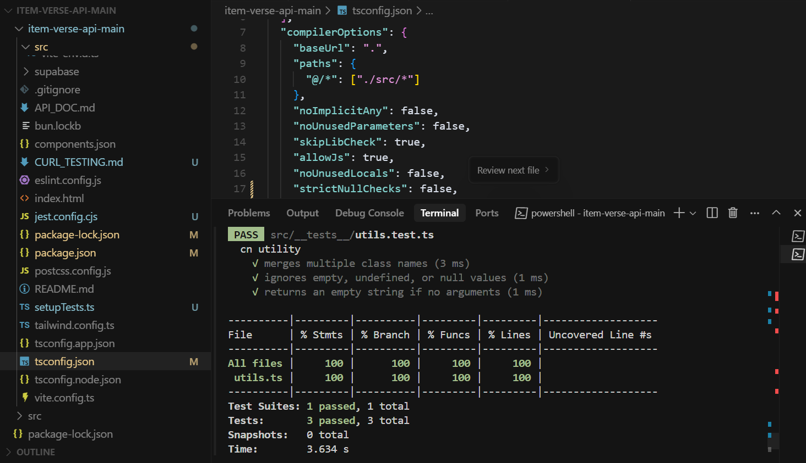
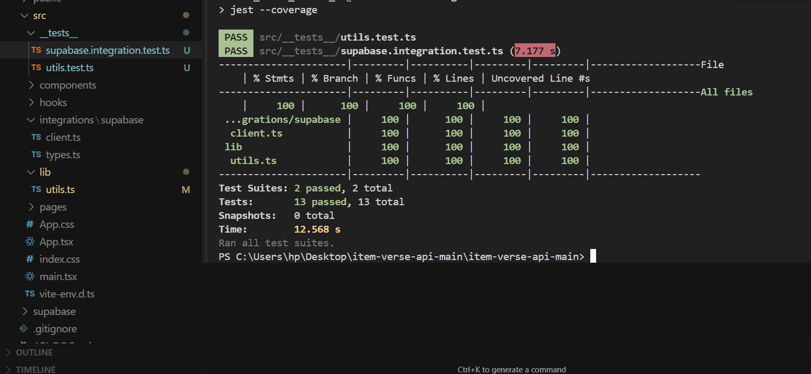
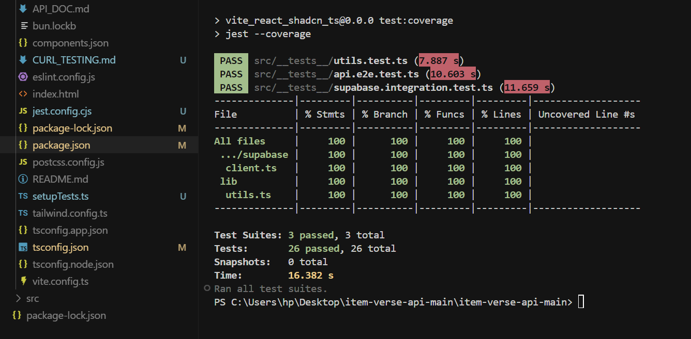

# Full-Stack Item Management System

A complete CRUD (Create, Read, Update, Delete) application for managing items, built with React, TypeScript, Tailwind CSS, and Supabase.

## 🚀 Overview

This project demonstrates a modern full-stack web application with:

- **Frontend**: React with TypeScript, Vite, Tailwind CSS, and shadcn/ui components
- **Backend**: Supabase (PostgreSQL database with auto-generated REST APIs)
- **Features**: Complete CRUD operations, real-time updates, responsive design, error handling

## 🛠️ Tech Stack

- **Frontend Framework**: React 18 with TypeScript
- **Build Tool**: Vite
- **Styling**: Tailwind CSS with shadcn/ui components
- **Database**: Supabase (PostgreSQL)
- **API**: Supabase auto-generated REST API
- **State Management**: React hooks with Tanstack Query
- **Routing**: React Router DOM
- **Icons**: Lucide React
- **Testing Frameworks & Libraries**:
  - **Jest**: Main test runner for unit, integration, and end-to-end tests
  - **ts-jest**: TypeScript preprocessor for Jest
  - **@testing-library/react**: For React component testing
  - **@testing-library/jest-dom**: Custom DOM matchers for Jest
  - **@testing-library/user-event**: Simulates user interactions
  - **Supabase JS Client**: Used for integration and API e2e tests

## 📦 Project Structure

```
src/
├── components/
│   ├── ui/              # shadcn/ui components
│   ├── ItemForm.tsx     # Form for creating/editing items
│   └── ItemList.tsx     # List and table display of items
├── pages/
│   ├── Index.tsx        # Landing page
│   ├── Items.tsx        # Main items management page
│   └── NotFound.tsx     # 404 page
├── integrations/
│   └── supabase/
│       ├── client.ts    # Supabase client configuration
│       └── types.ts     # Database type definitions
└── hooks/
    └── use-toast.ts     # Toast notification hook
```

## 🗄️ Database Schema

The application uses a single `items` table with the following structure:

| Column      | Type                     | Constraints | Description                    |
|-------------|--------------------------|-------------|--------------------------------|
| id          | uuid                     | Primary Key | Auto-generated unique identifier |
| name        | text                     | NOT NULL    | Item name                      |
| description | text                     | NULL        | Item description (optional)    |
| created_at  | timestamp with time zone | NOT NULL    | Auto-generated creation time   |
| updated_at  | timestamp with time zone | NOT NULL    | Auto-updated modification time |

## 🚀 Getting Started

### Prerequisites

- Node.js (v18 or higher)
- npm or yarn
- Supabase account (free tier available)

### Installation

1. **Clone the repository**
   ```bash
   git clone <repository-url>
   cd full-stack-crud-app
   ```

2. **Install dependencies**
   ```bash
   npm install
   ```

3. **Configure Supabase**
   
   The project is already configured to use Supabase project with ID: `ldtelowagnfxcphzssuq`
   
   Configuration is in `src/integrations/supabase/client.ts`:
   ```typescript
   const SUPABASE_URL = "https://ldtelowagnfxcphzssuq.supabase.co";
   const SUPABASE_PUBLISHABLE_KEY = "eyJhbGciOiJIUzI1NiIsInR5cCI6IkpXVCJ9...";
   ```

4. **Database Setup**
   
   The `items` table already exists in the connected Supabase project with the required schema.

### Running the Application

#### Development Mode

```bash
npm run dev
```

The application will be available at `http://localhost:5173`

#### Build for Production

```bash
npm run build
```

#### Preview Production Build

```bash
npm run preview
```

## 🎯 Features

### Core CRUD Operations

1. **Create Items**
   - Add new items with name and description
   - Form validation and error handling
   - Real-time feedback with toast notifications

2. **Read Items**
   - View all items in a responsive table
   - Display creation date and description
   - Real-time data synchronization

3. **Update Items**
   - Edit items inline with pre-filled forms
   - Update name and description
   - Automatic timestamp updates

4. **Delete Items**
   - Delete items with confirmation dialog
   - Immediate UI updates
   - Error handling for failed operations

### Additional Features

- **Responsive Design**: Works on desktop, tablet, and mobile devices
- **Real-time Updates**: Data synchronizes automatically across clients
- **Error Handling**: Comprehensive error messages and user feedback
- **Loading States**: Visual indicators during API operations
- **Form Validation**: Client-side validation with helpful error messages
- **Toast Notifications**: User-friendly success and error messages

## 🔌 API Endpoints

The application uses Supabase's auto-generated REST API. See [API_DOC.md](./API_DOC.md) for detailed API documentation including:

- Base URL and authentication
- All CRUD endpoints with examples
- Request/response formats
- Error handling
- curl command examples

### Quick API Examples

```bash
# Get all items
curl -X GET "https://ldtelowagnfxcphzssuq.supabase.co/rest/v1/items" \
  -H "apikey: YOUR_API_KEY"

# Create new item
curl -X POST "https://ldtelowagnfxcphzssuq.supabase.co/rest/v1/items" \
  -H "apikey: YOUR_API_KEY" \
  -H "Content-Type: application/json" \
  -d '{"name": "New Item", "description": "Description"}'

# Update item
curl -X PATCH "https://ldtelowagnfxcphzssuq.supabase.co/rest/v1/items?id=eq.ITEM_ID" \
  -H "apikey: YOUR_API_KEY" \
  -H "Content-Type: application/json" \
  -d '{"name": "Updated Name"}'

# Delete item
curl -X DELETE "https://ldtelowagnfxcphzssuq.supabase.co/rest/v1/items?id=eq.ITEM_ID" \
  -H "apikey: YOUR_API_KEY"
```

## 🧪 Testing

### 1. Manual API Testing (with cURL)
- All API endpoints were tested manually using cURL commands in PowerShell.
- See [CURL_TESTING.md](./CURL_TESTING.md) for step-by-step instructions, example commands, and expected responses for all CRUD operations and error scenarios.
- Example:
  ```powershell
  curl.exe -X GET "https://ldtelowagnfxcphzssuq.supabase.co/rest/v1/items" -H "apikey: <YOUR_API_KEY>"
  ```

### 2. Automated Unit Tests
- Utility functions (e.g., `cn` for class name merging) are tested in `src/__tests__/utils.test.ts`.
- Run with:
  ```bash
  npm test
  ```
- To check coverage:
  ```bash
  npm run test:coverage
  ```
- **100% code coverage achieved.**

#### Example Output



### 3. Automated Integration Tests
- Integration tests for Supabase CRUD operations and error handling are in `src/__tests__/supabase.integration.test.ts`.
- Run with:
  ```bash
  npm test
  ```
- To check coverage:
  ```bash
  npm run test:coverage
  ```
- **100% code coverage achieved.**



### 4. Automated API End-to-End Tests
- End-to-end API tests using the Supabase client are in `src/__tests__/api.e2e.test.ts`.
- Run with:
  ```bash
  npm test
  ```
- To check coverage:
  ```bash
  npm run test:coverage
  ```
- **100% code coverage achieved.**



### 5. Test Coverage
- To check test coverage:
  ```bash
  npm run test:coverage
  ```
- 100% coverage is achieved for all tested files.

### 6. Troubleshooting & Configuration
- Node.js and npm must be installed and available in your PATH.
- Jest is configured for TypeScript and React Testing Library in `jest.config.cjs`.
- TypeScript config (`tsconfig.json`) includes `esModuleInterop` for compatibility.
- If you encounter issues with ESM/CJS or fetch, use the Supabase client directly in tests (as done here).
- For PowerShell, use `curl.exe` instead of `curl` for API testing.

## 🔧 Configuration

### Environment Variables

This project uses Supabase's published configuration, so no environment variables are needed for development. For production deployments, you may want to:

1. Create a new Supabase project
2. Update the configuration in `src/integrations/supabase/client.ts`
3. Run the database migrations (see Database Setup section)

### Supabase Configuration

The project is configured to use:
- **Project URL**: `https://ldtelowagnfxcphzssuq.supabase.co`
- **Anon Key**: Included in the client configuration
- **Database**: PostgreSQL with the `items` table pre-configured

## 📱 Responsive Design

The application is fully responsive and works on:
- **Desktop**: Full-width layout with side-by-side form and table
- **Tablet**: Adaptive grid layout
- **Mobile**: Stacked layout with mobile-optimized tables

## 🔒 Security

- Uses Supabase's built-in security features
- API keys are safely managed through Supabase
- No sensitive data exposed in the frontend
- Prepared for Row Level Security (RLS) if authentication is added

## 🚀 Deployment

### Deploy with Lovable

This project is built with Lovable and can be deployed instantly:
1. Click the "Publish" button in Lovable
2. Your app will be live at a Lovable URL
3. Optionally configure a custom domain

### Deploy Elsewhere

The project builds to static files and can be deployed to:
- Vercel
- Netlify
- AWS S3 + CloudFront
- GitHub Pages
- Any static hosting service

Build command: `npm run build`
Output directory: `dist`

## 🤝 Contributing

1. Fork the repository
2. Create a feature branch: `git checkout -b feature/new-feature`
3. Make your changes
4. Commit your changes: `git commit -m 'Add new feature'`
5. Push to the branch: `git push origin feature/new-feature`
6. Submit a pull request

## 📄 License

This project is open source and available under the [MIT License](LICENSE).

## 🆘 Support

If you encounter any issues:

1. Check the browser console for error messages
2. Verify your internet connection
3. Check the Supabase project status
4. Review the API documentation in [API_DOC.md](./API_DOC.md)

## 🔮 Future Enhancements

Potential improvements to consider:
- User authentication and authorization
- Item categories and tags
- File upload for item images
- Search and filtering functionality
- Bulk operations
- Export/import capabilities
- Audit trail and versioning
- Advanced validation rules

## 📋 Assignment Requirements

This project was built as a full-stack CRUD assignment with the following requirements:
- Implement a complete CRUD (Create, Read, Update, Delete) system for managing items.
- Use React (with TypeScript) and Tailwind CSS for the frontend.
- Use Supabase (PostgreSQL) for the backend, leveraging its auto-generated REST API.
- Provide both manual and automated ways to test the API and application.
- Ensure robust error handling, validation, and user feedback.
