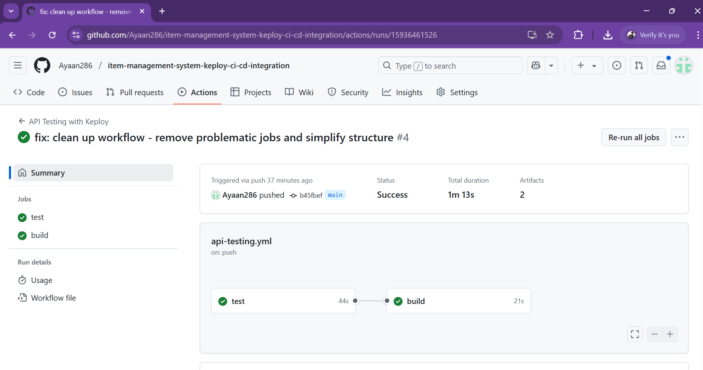
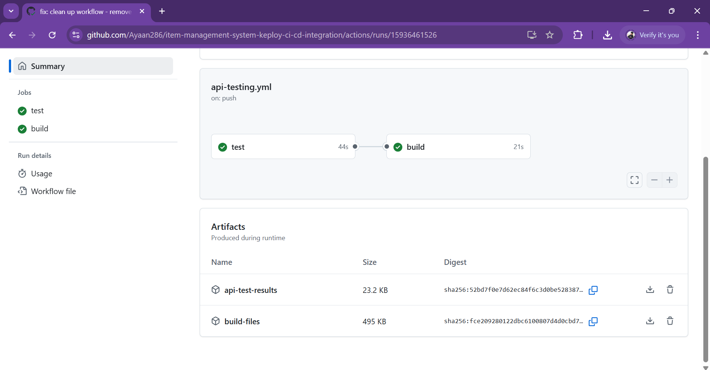
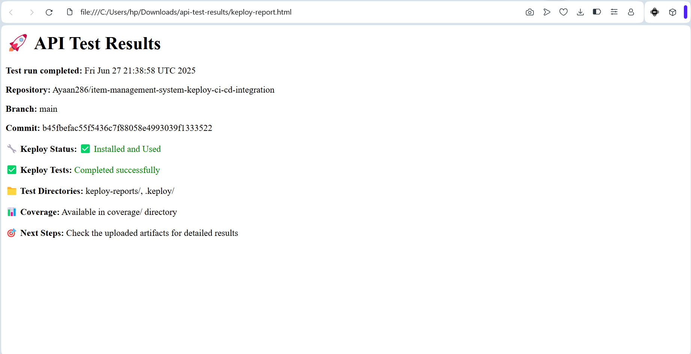

# Item Management System with Keploy CI/CD Integration

A modern full-stack item management application built with React, TypeScript, Tailwind CSS, and Supabase, featuring AI-powered API testing with Keploy and automated CI/CD pipeline.

## 🚀 Features

- **Modern UI**: Built with React 18, TypeScript, and Tailwind CSS
- **Real-time Database**: Powered by Supabase with PostgreSQL
- **AI-Powered Testing**: Automated API testing with Keploy
- **CI/CD Pipeline**: GitHub Actions for automated testing and deployment
- **Responsive Design**: Works on desktop, tablet, and mobile
- **Type Safety**: Full TypeScript implementation
- **Modern Tooling**: Vite, ESLint, Jest, and more

## 🛠️ Tech Stack

- **Frontend**: React 18, TypeScript, Tailwind CSS, Shadcn/ui
- **Backend**: Supabase (PostgreSQL, Auth, Real-time)
- **Testing**: Jest, Keploy (AI-powered API testing)
- **CI/CD**: GitHub Actions
- **Build Tool**: Vite
- **Package Manager**: npm

## 📦 Installation

1. **Clone the repository**
   ```bash
   git clone https://github.com/Ayaan286/item-management-system-keploy-ci-cd-integration.git
   cd item-management-system-keploy-ci-cd-integration
   ```

2. **Install dependencies**
   ```bash
   npm install
   ```

3. **Database Setup**
   The project uses a pre-configured Supabase instance:
   - **Project URL**: `https://ldtelowagnfxcphzssuq.supabase.co`
   - **API Key**: Included in the client configuration
   - **Database**: PostgreSQL with `items` table pre-configured

4. **Start the development server**
   ```bash
   npm run dev
   ```

   The application will be available at `http://localhost:5173`

## 🧪 Testing

### Unit & Integration Tests

```bash
# Run all tests
npm test

# Run tests with coverage
npm run test:coverage

# Run tests in watch mode
npm test -- --watch
```

### API Testing with Keploy

```bash
# Install Keploy
npm run keploy:install

# Run API tests
npm run api:test
```

### Manual API Testing

```bash
# Run simple API test script
node test-api.js
```

## 🔌 API Documentation

The application uses Supabase's auto-generated REST API. See [API_DOC.md](./API_DOC.md) for detailed API documentation including:

- Base URL and authentication
- All CRUD endpoints with examples
- Request/response formats
- Error handling
- curl command examples

### Quick API Examples

```bash
# Get all items
curl -X GET "https://ldtelowagnfxcphzssuq.supabase.co/rest/v1/items" \
  -H "apikey: YOUR_API_KEY"

# Create new item
curl -X POST "https://ldtelowagnfxcphzssuq.supabase.co/rest/v1/items" \
  -H "apikey: YOUR_API_KEY" \
  -H "Content-Type: application/json" \
  -d '{"name": "New Item", "description": "Description"}'

# Update item
curl -X PATCH "https://ldtelowagnfxcphzssuq.supabase.co/rest/v1/items?id=eq.ITEM_ID" \
  -H "apikey: YOUR_API_KEY" \
  -H "Content-Type: application/json" \
  -d '{"name": "Updated Name"}'

# Delete item
curl -X DELETE "https://ldtelowagnfxcphzssuq.supabase.co/rest/v1/items?id=eq.ITEM_ID" \
  -H "apikey: YOUR_API_KEY"
```

## 🔄 CI/CD Pipeline

The project includes automated testing with GitHub Actions:

- ✅ **Unit Tests**: Jest with coverage reporting
- ✅ **API Tests**: Keploy AI-powered testing
- ✅ **Build Process**: Automatic production builds
- ✅ **Test Reports**: Detailed results and artifacts

The pipeline runs automatically on:
- Push to main branch
- Pull requests
- Manual triggers

## 🚀 CI/CD Pipeline with Keploy

Our project includes a comprehensive CI/CD pipeline with AI-powered API testing using Keploy.

### Successful Workflow Run


### Test Artifacts Generated


### API Test Results


## 📊 Database Schema

The `items` table structure:

| Column      | Type                     | Constraints | Description                    |
|-------------|--------------------------|-------------|--------------------------------|
| id          | uuid                     | Primary Key | Auto-generated unique identifier |
| name        | text                     | NOT NULL    | Item name                      |
| description | text                     | NULL        | Item description (optional)    |
| created_at  | timestamp with time zone | NOT NULL    | Auto-generated creation time   |
| updated_at  | timestamp with time zone | NOT NULL    | Auto-updated modification time |

## 🚀 Deployment

### Build for Production
```bash
npm run build
```

### Deploy Options
- **Vercel**: Connect GitHub repository for automatic deployment
- **Netlify**: Drag and drop `dist/` folder
- **AWS S3**: Upload build artifacts to S3 bucket
- **GitHub Pages**: Enable Pages in repository settings

## 🔧 Configuration

### Environment Variables

This project uses Supabase's published configuration, so no environment variables are needed for development. For production deployments, you may want to:

1. Create a new Supabase project
2. Update the configuration in `src/integrations/supabase/client.ts`
3. Run the database migrations (see Database Setup section)

### Supabase Configuration

The project is configured to use:
- **Project URL**: `https://ldtelowagnfxcphzssuq.supabase.co`
- **Anon Key**: Included in the client configuration
- **Database**: PostgreSQL with the `items` table pre-configured

## 📱 Responsive Design

The application is fully responsive and works on:
- **Desktop**: Full-width layout with side-by-side form and table
- **Tablet**: Adaptive grid layout
- **Mobile**: Stacked layout with mobile-optimized tables

## 🔒 Security

- Uses Supabase's built-in security features
- API keys are safely managed through Supabase
- No sensitive data exposed in the frontend
- Prepared for Row Level Security (RLS) if authentication is added

## 🤝 Contributing

1. Fork the repository
2. Create a feature branch: `git checkout -b feature/new-feature`
3. Make your changes
4. Commit your changes: `git commit -m 'Add new feature'`
5. Push to the branch: `git push origin feature/new-feature`
6. Submit a pull request

## 📄 License

This project is open source and available under the [MIT License](LICENSE).

## 🆘 Support

If you encounter any issues:

1. Check the browser console for error messages
2. Verify your Supabase configuration
3. Ensure all dependencies are installed
4. Check the API documentation for endpoint details

For detailed API testing instructions, see [CURL_TESTING.md](./CURL_TESTING.md).

---

